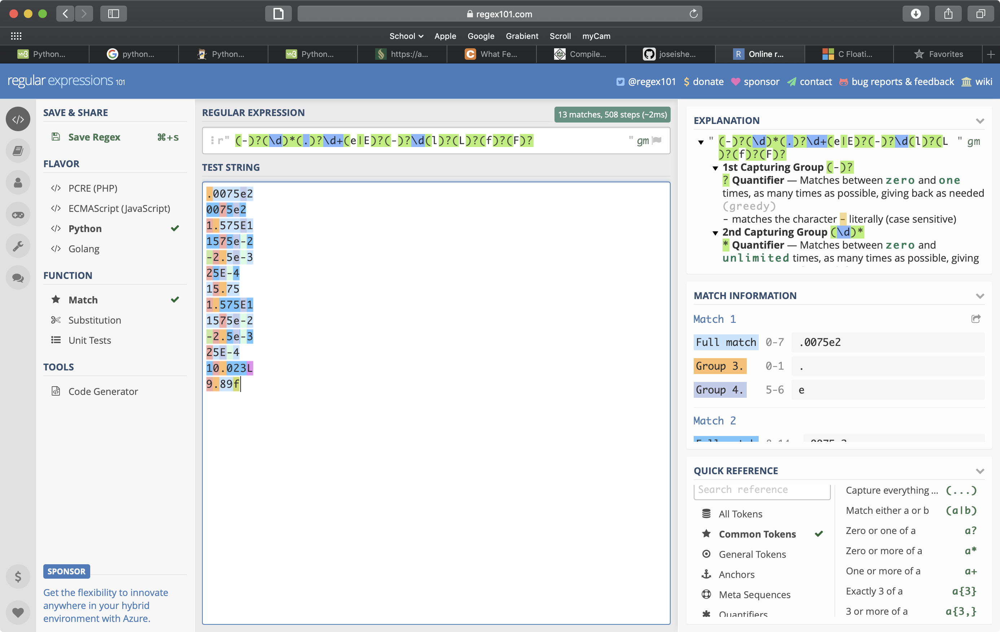
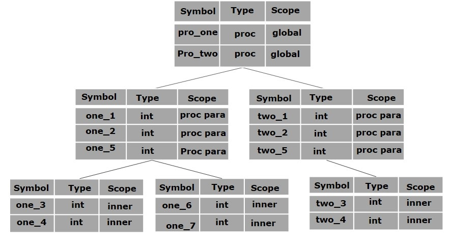
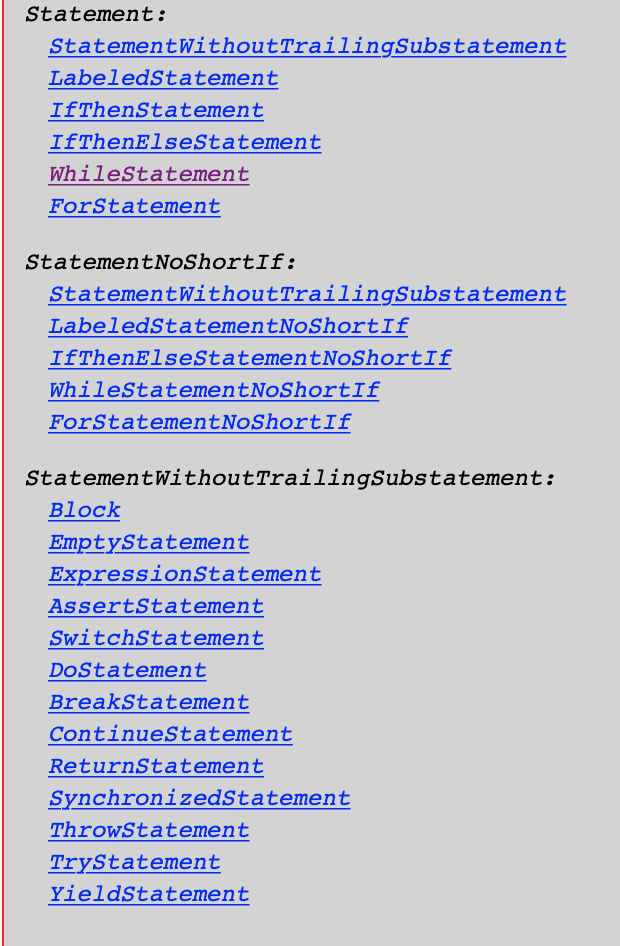
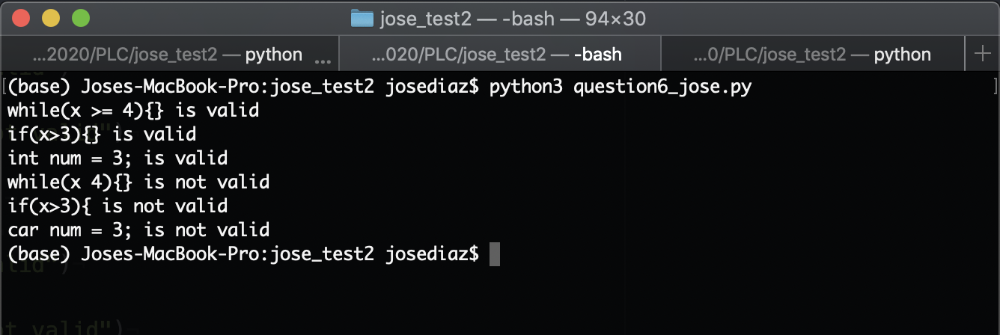

## PLC Test 2 - Jose Diaz


1. (20 points) Create code that allows you to create an ordered list of tokens. This code should take in a file as input and process that file for the following lexemes:

	- All of the code can be found here: <https://github.com/joseishere/jose_test2>
	- For all of these problems I wrote them in python and made one file that would read all of my test strings from a file
	- I have several files so here is all of the files with their respective code and the last file is the one that combines it all
	
	```python
	# tryFloat.py
	import re
	
	def floatChecker(arr):
	
	    # I did this one with regex after people started to talk about how they used it in the plc group chat
	    # of course all of the other ones I didn't do with regex bc they were already done
	    # really wish i would have done everything with regex
	    # also I used this website to help me build the regex string
	    # it is really well made and you should donate to help keep it running
	    # the website is : https://regex101.com
	
	    regexBase = r"(-)?(\d)*(.)?\d+(e|E)?(-)?\d(l|L|f|F)?"
	
	    if(re.fullmatch(regexBase, arr)):
	        # print('is valid')
	        return True
	    else:
	        return False
	
	
	def main():
	
	    words = ["23.75", "0.59201E1", "1312221215e-2", "-2.5e-3", "15E-4", "121.0L", "122.0F", "1x0.0F", ".02ef3", "0.01ee1", "0.5e1lf", "69e--2"]
	
	
	    for word in words:
	        if(floatChecker(word)):
	            print(word + " is valid")
	        else:
	            print(word + " is not valid")
	
	
	if __name__ == "__main__":
	    main()

	
	```
	
	- 
	- As you can see I fixed this one because I was getting some test cases that didn't work. My final program works perfectly though regex is insanely OP.
	
	```python
	# tryInt.py
	hex_vals = {
	    'a':'a',
	    'A':'A',
	    'b':'b',
	    'B':'B',
	    'c':'c',
	    'C':'C',
	    'd':'d',
	    'D':'D',
	    'e':'e',
	    'E':'E',
	    'f':'f',
	    'F':'F',
	}
	def intChecker(arr):
	    foundu = False
	    foundU = False
	    size = len(arr)
	    try:
	        letterFound = arr[2:].find(next(filter(str.isalpha, arr[2:])))
	    except:
	        letterFound = -1
	    #print(letterFound)
	    if(size < 2):
	        return False
	    if(arr[0] == '0' and arr[1] == 'x' or arr[1] == 'X'):
	
	        xo={
	            'a' : 'u',
	            'b' : 'U',
	            'c' : 'l',
	            'd' : 'L'
	        }
	
	        size = len(arr) - 1
	        suffix = [None] * len(arr)
	
	        while(size >= 0):
	            #print(size)
	            if(arr[size] in xo.values()):
	                suffix[size] = arr[size]
	            else:
	                break
	            size -= 1
	        #print(suffix)
	        temp = ''
	        for each in suffix:
	            if(each is not None):
	                temp += each
	        #print(temp)
	        #print("final size : " + str(size))
	
	        if(size != len(arr) - 1):
	            for char in arr[2:size+1]:
	                #print(char)
	                if(char.isnumeric() or char in hex_vals.values()):
	                    #print('what')
	                    pass
	                else:
	                    print('ere')
	                    return False
	            return (True and checkEnd(arr, size+1, 'hex'))
	        else:
	            return True
	
	    elif(arr[0] == '0' and arr[1] < '8'):
	        if(letterFound != -1):
	            for char in arr[2:letterFound+2]:
	                #print(char)
	                if(char < '8'):
	                    pass
	                else:
	                    #print('ere')
	                    return False
	            return (True and checkEnd(arr, letterFound+2, 'oct'))
	        else:
	            return True
	    elif(arr[0] != 0):
	        if(letterFound != -1):
	            for char in arr[2:letterFound+2]:
	                #print(char)
	                if(char.isnumeric()):
	                    pass
	                else:
	                    #print('ere')
	                    return False
	            return (True and checkEnd(arr, letterFound+2, 'dec'))
	        else:
	            return True
	    else:
	        return False
	
	def checkEnd(arr, startLetter, type):
	    endString = arr[startLetter:]
	    #print(endString, "end string")
	    dec_endings = {
	        'u':'u',
	        'l':'l',
	        'ul':'ul',
	        'LL':'LL',
	        'ull':'ull',
	    }
	    hex_endings = {
	        'u':'u',
	        'l':'l',
	        'uL':'uL',
	        'll':'ll',
	        'uLL':'uLL',
	    }
	    oct_endings = {
	        'u':'u',
	        'l':'l',
	        'UL':'UL',
	        'll':'ll',
	        'Ull':'Ull',
	    }
	
	
	    whereToLook = str(type) + "_endings"
	    #print(whereToLook)
	    if(type == 'dec'):
	        if(endString in dec_endings.values()):
	            #print('checkend returned true')
	            return True
	        else:
	            return False
	    elif(type == 'hex'):
	        if(endString in hex_endings.values()):
	            #print('checkend returned true')
	            return True
	        else:
	            return False
	    elif(type == 'oct'):
	        if(endString in oct_endings.values()):
	            #print('checkend returned true')
	            return True
	        else:
	            return False
	    else:
	        return False
	
	
	def main():
	
	    words = ["28","4000000024u","2000000022l","4000000000ul","9000000000LL","900000000001ull","024","04000000024u","02000000022l","04000000000UL", "044000000000000ll","044400000000000001Ull", "0x2a", '0XA0000024uu', '0x20000022ll','0XA0000021uLLL','0x8a000000000000lll','0x8A40000000000010uLLL']
	
	    for word in words:
	        if(intChecker(word)):
	            print(word + " is valid")
	        else:
	            print(word + " is not valid")
	
	
	
	if __name__ == "__main__":
	    main()

	
	```
	
	```
	# tryChar.py
	symbols ={
	    '~' : '~' ,
	    '`' : '`' ,
	    '!' : '!' ,
	    '@' : '@' ,
	    '#' : '#' ,
	    '$' : '$' ,
	    '%' : '%' ,
	    '^' : '^' ,
	    '&' : '&' ,
	    '*' : '*' ,
	    '(' : '(' ,
	    ')' : ')' ,
	    '-' : '-' ,
	    '_' : '_' ,
	    '+' : '+' ,
	    '=' : '=' ,
	    '{' : '{' ,
	    '[' : '[' ,
	    '}' : '}' ,
	    ']' : ']' ,
	    '|' : '|' ,
	    ':' : ':' ,
	    ';' : ';' ,
	    '<' : '<',
	    ',' : ',',
	    '>' : '>',
	    '.' : '.',
	    '?' : '?',
	}
	
	after_slash = {
	    'b':'b',
	    'f':'f',
	    'n':'n',
	    'r':'r',
	    '"':'"',
	    '\\':'\\',
	    "'":"'",
	    'v':'v',
	    'a':'a',
	    '?':'?',
	    'N':'N',
	    'X':'X',
	    't':'t',
	}
	
	
	def charChecker(arr):
	    # this is very similar to the java string, so took the same algorithm from my java string and adapted it here
	    # i think we first need to handle the simplest case just making sure that we have the correct open and close
	    size = len(arr)
	    count = 0
	    # need this to handle the /XN
	    isX = False
	
	    # we cant have an empty string or 'a
	    # and we know we can't have anything more than 5
	    if(size >= 5 or size < 3):
	        return False
	    # print(arr[0], arr[-1])
	
	    if((arr[0] == '"' and arr[-1] == '"') or (arr[0] == "'" and arr[-1] == "'")):
	
	# don't need to check first letter since we know what it is
	# now we need to loop through the string and if we have a slash
	# we need to know that the next number, in this case arr[num] is a valid value
	# and we need to make sure that we only have an even number of slashes bc \\\
	# is not valid even though you can have a \ after a \
	        num = 1
	        for letter in arr[1:-1]:
	            #print(letter, "printing letter hereeee")
	            num +=1
	            if(letter.isalnum() or letter in symbols.values()):
	                pass
	            elif(letter == '\\'):
	                count+=1
	                # print(count)
	                if(isX):
	                    if(arr[num] != 'N'):
	                        return False
	                elif(arr[num] in after_slash.values()):
	                    #print(str(size) + " size")
	                    if(arr[num] == 'X'):
	                        isX = True
	                    if(num < size-1):
	                        count+=-1
	                        #print(count)
	                elif(arr[num] not in after_slash.values()):
	                    return False
	            else:
	                pass
	    else:
	        return False
	    if(count == 0):
	        return True
	
	    return True
	
	
	def main():
	
	    words = ["\'1\'", "\'!\'", "\"$\"", "\'\t\'", "\'\?\'", "\'\\\'", "\'\f\'", "\'\XN\'", "\']\'", "\'n\'", '\'e\"' , "v\'v\'",  '"024"']
	
	    for word in words:
	        if(charChecker(word)):
	            print(word + " is valid")
	        else:
	            print(word + " is not valid")
	
	if __name__ == "__main__":
	    main()

	```
	
	```python
	# tryJava.py
	after_slash = {
	    't':'t',
	    'r':'r',
	    'n':'n',
	    'f':'f',
	    '"':'"',
	    '\\':'\\',
	
	}
	
	def javaChecker(arr):
	    # i think we first need to handle the simplest case just making sure that we have " "
	    size = len(arr)
	    count = 0
	    preCount = 0
	    if(size < 3):
	        return False
	    for letter in arr:
	        if(letter == '\\'):
	            preCount+=1
	
	    if(arr[0] == "'" and arr[1] != "\\" and arr[2] == "'" and len(arr) == 3 ):
	        return True
	# this is so that we know that the string starts and ends with quotation mark
	    if(arr[0] == '"' and arr[-1] == '"'):
	# don't need to check first letter since we know what it is
	# now we need to loop through the string and if we have a slash
	# we need to know that the next number, in this case arr[num] is a valid value
	# and we need to make sure that we only have an even number of slashes bc \\\
	# is not valid even though you can have a \ after a \
	        num = 1
	        for letter in arr[1:-1]:
	            num +=1
	            if(letter == '\\'):
	                count+=1
	                # print(count)
	                if(arr[num] in after_slash.values()):
	                    if(num < size-1):
	                        count+=-1
	                        # print(count)
	                if(arr[num] not in after_slash.values()):
	                    return False
	    if(count != 0):
	        return False
	
	    return True
	
	
	def main():
	    # the way this works is if you copy and paste my output into a java compiler, these strings will be valid
	    # this is due to how the strings go into the function but it is what it is
	    words = ["'a'", '"string?"', '"string\t"', '"str\\"', '"stri\\"s"', '"st\\"ri\\"s"', "valid??@123", '"val33\\{1!@#$%"']
	
	    for word in words:
	        if(javaChecker(word)):
	            print(word + " is valid")
	        else:
	            print(word + " is not valid")
	
	if __name__ == '__main__':
	    main()

	```
	
	```python
	# tryOperator.py
	def operatorChecker(op):
	    # we need to make sure that we get an operator and not empty string
	    # and that the length of the operator is never more than 4
	    if(len(op) > 4):
	        return False
	
	    # now we just see what it is
	
	    if (op == '+' ):
	        return True
	    elif (op == '-' ):
	        return True
	    elif (op == '='):
	        return True
	    elif (op == '-'):
	        return True
	    elif (op == '/'):
	        return True
	    elif (op == '*'):
	        return True
	    elif (op == '%'):
	        return True
	    elif (op == '{'):
	        return True
	    elif (op == '}'):
	        return True
	    elif (op == '('):
	        return True
	    elif (op == ')'):
	        return True
	    elif (op == '++'):
	        return True
	    elif (op == '--'):
	        return True
	    elif (op == '&&'):
	        return True
	    elif (op == '||'):
	        return True
	    elif (op == '!'):
	        return True
	    else:
	        return False
	
	def main():
	    words = ['+', '-', '/', '%', '+-', '', 'faill', '$$', '1']
	
	    for word in words:
	        if(operatorChecker(word)):
	            print(word + " is valid")
	        else:
	            print(word + " is not valid")
	
	if __name__ == "__main__":
		main()

	```
	
	```python
	# tryPerl.py
	def perlChecker(word):
	    if(len(word) < 2):
	        return False
	    foundStart = None
	    for letter in word:
	        if(letter.isalnum() or letter == '$' or letter == '@' or letter == '%' or letter == '_'):
	            if (foundStart == None):
	                if( (letter == "$" or letter == "%" or letter == "@")):
	                    foundStart = letter
	                else:
	                    return False
	            else:
	                # now we just need numbers or underscore
	                if( letter.isalnum() or letter == "_"):
	                    pass
	                else:
	                    return False
	        else:
	            return False
	    return True
	
	def main():
	
	    words = ['$var_sas', '@another2', '@test', '%another\s', '$test_$', '#testt', '@test#w']
	    for word in words:
	        if(perlChecker(word)):
	            print(word + " is valid")
	        else:
	            print(word + " is not valid")
	
	
	if __name__ == "__main__":
	    main()

	```
	
	```python
	# getWords.py
	# gets all of the words from a file
	def fromFile(fileName):
	    f = open(fileName, 'r')
	    finalList = f.read().split('\n')
	    return finalList
	
	def main():
	    print(fromFile('testInputs.txt'))
	
	
	if __name__ == '__main__':
	    main()

	```
	```
	# finalOut.txt
	# output of above program
		
	'1'
	'1' C Char: 			 VALID
	'1' C Float: not VALID
	'1' C Int: 			 VALID
	'1' Java String: 			 VALID
	'1' Operator: not VALID
	'1' Perl Identifier: not VALID
	
	'!'
	'!' C Char: 			 VALID
	'!' C Float: not VALID
	'!' C Int: 			 VALID
	'!' Java String: 			 VALID
	'!' Operator: not VALID
	'!' Perl Identifier: not VALID
	
	"$"
	"$" C Char: 			 VALID
	"$" C Float: not VALID
	"$" C Int: 			 VALID
	"$" Java String: 			 VALID
	"$" Operator: not VALID
	"$" Perl Identifier: not VALID
	
	'\t'
	'\t' C Char: 			 VALID
	'\t' C Float: not VALID
	'\t' C Int: not VALID
	'\t' Java String: 			 VALID
	'\t' Operator: not VALID
	'\t' Perl Identifier: not VALID
	
	'\?'
	'\?' C Char: 			 VALID
	'\?' C Float: not VALID
	'\?' C Int: 			 VALID
	'\?' Java String: 			 VALID
	'\?' Operator: not VALID
	'\?' Perl Identifier: not VALID
	
	'\\'
	'\\' C Char: 			 VALID
	'\\' C Float: not VALID
	'\\' C Int: 			 VALID
	'\\' Java String: 			 VALID
	'\\' Operator: not VALID
	'\\' Perl Identifier: not VALID
	
	'\f'
	'\f' C Char: 			 VALID
	'\f' C Float: not VALID
	'\f' C Int: not VALID
	'\f' Java String: 			 VALID
	'\f' Operator: not VALID
	'\f' Perl Identifier: not VALID
	
	'\XN'
	'\XN' C Char: not VALID
	'\XN' C Float: not VALID
	'\XN' C Int: not VALID
	'\XN' Java String: 			 VALID
	'\XN' Operator: not VALID
	'\XN' Perl Identifier: not VALID
	
	']'
	']' C Char: 			 VALID
	']' C Float: not VALID
	']' C Int: 			 VALID
	']' Java String: 			 VALID
	']' Operator: not VALID
	']' Perl Identifier: not VALID
	
	'n'
	'n' C Char: 			 VALID
	'n' C Float: not VALID
	'n' C Int: 			 VALID
	'n' Java String: 			 VALID
	'n' Operator: not VALID
	'n' Perl Identifier: not VALID
	
	'e"
	'e" C Char: not VALID
	'e" C Float: not VALID
	'e" C Int: 			 VALID
	'e" Java String: 			 VALID
	'e" Operator: not VALID
	'e" Perl Identifier: not VALID
	
	v\'v\'
	v\'v\' C Char: not VALID
	v\'v\' C Float: not VALID
	v\'v\' C Int: not VALID
	v\'v\' Java String: 			 VALID
	v\'v\' Operator: not VALID
	v\'v\' Perl Identifier: not VALID
	
	23.75
	23.75 C Char: not VALID
	23.75 C Float: 			 VALID
	23.75 C Int: 			 VALID
	23.75 Java String: 			 VALID
	23.75 Operator: not VALID
	23.75 Perl Identifier: not VALID
	
	0.59201E1
	0.59201E1 C Char: not VALID
	0.59201E1 C Float: 			 VALID
	0.59201E1 C Int: not VALID
	0.59201E1 Java String: 			 VALID
	0.59201E1 Operator: not VALID
	0.59201E1 Perl Identifier: not VALID
	
	1312221215e-2
	1312221215e-2 C Char: not VALID
	1312221215e-2 C Float: 			 VALID
	1312221215e-2 C Int: not VALID
	1312221215e-2 Java String: 			 VALID
	1312221215e-2 Operator: not VALID
	1312221215e-2 Perl Identifier: not VALID
	
	-2.5e-3
	-2.5e-3 C Char: not VALID
	-2.5e-3 C Float: 			 VALID
	-2.5e-3 C Int: not VALID
	-2.5e-3 Java String: 			 VALID
	-2.5e-3 Operator: not VALID
	-2.5e-3 Perl Identifier: not VALID
	
	15E-4
	15E-4 C Char: not VALID
	15E-4 C Float: 			 VALID
	15E-4 C Int: not VALID
	15E-4 Java String: 			 VALID
	15E-4 Operator: not VALID
	15E-4 Perl Identifier: not VALID
	
	121.0L
	121.0L C Char: not VALID
	121.0L C Float: not VALID
	121.0L C Int: not VALID
	121.0L Java String: 			 VALID
	121.0L Operator: not VALID
	121.0L Perl Identifier: not VALID
	
	122.0F
	122.0F C Char: not VALID
	122.0F C Float: not VALID
	122.0F C Int: not VALID
	122.0F Java String: 			 VALID
	122.0F Operator: not VALID
	122.0F Perl Identifier: not VALID
	
	1x0.0F
	1x0.0F C Char: not VALID
	1x0.0F C Float: not VALID
	1x0.0F C Int: not VALID
	1x0.0F Java String: 			 VALID
	1x0.0F Operator: not VALID
	1x0.0F Perl Identifier: not VALID
	
	.02ef3
	.02ef3 C Char: not VALID
	.02ef3 C Float: not VALID
	.02ef3 C Int: not VALID
	.02ef3 Java String: 			 VALID
	.02ef3 Operator: not VALID
	.02ef3 Perl Identifier: not VALID
	
	0.01ee1
	0.01ee1 C Char: not VALID
	0.01ee1 C Float: not VALID
	0.01ee1 C Int: not VALID
	0.01ee1 Java String: 			 VALID
	0.01ee1 Operator: not VALID
	0.01ee1 Perl Identifier: not VALID
	
	0.5e1lf
	0.5e1lf C Char: not VALID
	0.5e1lf C Float: not VALID
	0.5e1lf C Int: not VALID
	0.5e1lf Java String: 			 VALID
	0.5e1lf Operator: not VALID
	0.5e1lf Perl Identifier: not VALID
	
	69e--2
	69e--2 C Char: not VALID
	69e--2 C Float: not VALID
	69e--2 C Int: not VALID
	69e--2 Java String: 			 VALID
	69e--2 Operator: not VALID
	69e--2 Perl Identifier: not VALID
	
	28
	28 C Char: not VALID
	28 C Float: 			 VALID
	28 C Int: 			 VALID
	28 Java String: not VALID
	28 Operator: not VALID
	28 Perl Identifier: not VALID
	
	4000000024u
	4000000024u C Char: not VALID
	4000000024u C Float: not VALID
	4000000024u C Int: 			 VALID
	4000000024u Java String: 			 VALID
	4000000024u Operator: not VALID
	4000000024u Perl Identifier: not VALID
	
	2000000022l
	2000000022l C Char: not VALID
	2000000022l C Float: 			 VALID
	2000000022l C Int: 			 VALID
	2000000022l Java String: 			 VALID
	2000000022l Operator: not VALID
	2000000022l Perl Identifier: not VALID
	
	4000000000ul
	4000000000ul C Char: not VALID
	4000000000ul C Float: not VALID
	4000000000ul C Int: 			 VALID
	4000000000ul Java String: 			 VALID
	4000000000ul Operator: not VALID
	4000000000ul Perl Identifier: not VALID
	
	9000000000LL
	9000000000LL C Char: not VALID
	9000000000LL C Float: not VALID
	9000000000LL C Int: 			 VALID
	9000000000LL Java String: 			 VALID
	9000000000LL Operator: not VALID
	9000000000LL Perl Identifier: not VALID
	
	900000000001ull
	900000000001ull C Char: not VALID
	900000000001ull C Float: not VALID
	900000000001ull C Int: 			 VALID
	900000000001ull Java String: 			 VALID
	900000000001ull Operator: not VALID
	900000000001ull Perl Identifier: not VALID
	
	024
	024 C Char: not VALID
	024 C Float: 			 VALID
	024 C Int: 			 VALID
	024 Java String: 			 VALID
	024 Operator: not VALID
	024 Perl Identifier: not VALID
	
	04000000024u
	04000000024u C Char: not VALID
	04000000024u C Float: not VALID
	04000000024u C Int: 			 VALID
	04000000024u Java String: 			 VALID
	04000000024u Operator: not VALID
	04000000024u Perl Identifier: not VALID
	
	02000000022l
	02000000022l C Char: not VALID
	02000000022l C Float: 			 VALID
	02000000022l C Int: 			 VALID
	02000000022l Java String: 			 VALID
	02000000022l Operator: not VALID
	02000000022l Perl Identifier: not VALID
	
	04000000000UL
	04000000000UL C Char: not VALID
	04000000000UL C Float: not VALID
	04000000000UL C Int: 			 VALID
	04000000000UL Java String: 			 VALID
	04000000000UL Operator: not VALID
	04000000000UL Perl Identifier: not VALID
	
	044000000000000ll
	044000000000000ll C Char: not VALID
	044000000000000ll C Float: not VALID
	044000000000000ll C Int: 			 VALID
	044000000000000ll Java String: 			 VALID
	044000000000000ll Operator: not VALID
	044000000000000ll Perl Identifier: not VALID
	
	044400000000000001Ull
	044400000000000001Ull C Char: not VALID
	044400000000000001Ull C Float: not VALID
	044400000000000001Ull C Int: 			 VALID
	044400000000000001Ull Java String: 			 VALID
	044400000000000001Ull Operator: not VALID
	044400000000000001Ull Perl Identifier: not VALID
	
	0x2a
	0x2a C Char: not VALID
	0x2a C Float: not VALID
	0x2a C Int: 			 VALID
	0x2a Java String: 			 VALID
	0x2a Operator: not VALID
	0x2a Perl Identifier: not VALID
	
	0XA0000024uu
	0XA0000024uu C Char: not VALID
	0XA0000024uu C Float: not VALID
	0XA0000024uu C Int: not VALID
	0XA0000024uu Java String: 			 VALID
	0XA0000024uu Operator: not VALID
	0XA0000024uu Perl Identifier: not VALID
	
	0x20000022ll
	0x20000022ll C Char: not VALID
	0x20000022ll C Float: not VALID
	0x20000022ll C Int: 			 VALID
	0x20000022ll Java String: 			 VALID
	0x20000022ll Operator: not VALID
	0x20000022ll Perl Identifier: not VALID
	
	0XA0000021uLLL
	0XA0000021uLLL C Char: not VALID
	0XA0000021uLLL C Float: not VALID
	0XA0000021uLLL C Int: not VALID
	0XA0000021uLLL Java String: 			 VALID
	0XA0000021uLLL Operator: not VALID
	0XA0000021uLLL Perl Identifier: not VALID
	
	0x8a000000000000lll
	0x8a000000000000lll C Char: not VALID
	0x8a000000000000lll C Float: not VALID
	0x8a000000000000lll C Int: not VALID
	0x8a000000000000lll Java String: 			 VALID
	0x8a000000000000lll Operator: not VALID
	0x8a000000000000lll Perl Identifier: not VALID
	
	0x8A40000000000010uLLL
	0x8A40000000000010uLLL C Char: not VALID
	0x8A40000000000010uLLL C Float: not VALID
	0x8A40000000000010uLLL C Int: not VALID
	0x8A40000000000010uLLL Java String: 			 VALID
	0x8A40000000000010uLLL Operator: not VALID
	0x8A40000000000010uLLL Perl Identifier: not VALID
	
	"a"
	"a" C Char: 			 VALID
	"a" C Float: not VALID
	"a" C Int: 			 VALID
	"a" Java String: 			 VALID
	"a" Operator: not VALID
	"a" Perl Identifier: not VALID
	
	"string?"
	"string?" C Char: not VALID
	"string?" C Float: not VALID
	"string?" C Int: not VALID
	"string?" Java String: 			 VALID
	"string?" Operator: not VALID
	"string?" Perl Identifier: not VALID
	
	"string\t"
	"string\t" C Char: not VALID
	"string\t" C Float: not VALID
	"string\t" C Int: not VALID
	"string\t" Java String: 			 VALID
	"string\t" Operator: not VALID
	"string\t" Perl Identifier: not VALID
	
	"str\\"
	"str\\" C Char: not VALID
	"str\\" C Float: not VALID
	"str\\" C Int: not VALID
	"str\\" Java String: not VALID
	"str\\" Operator: not VALID
	"str\\" Perl Identifier: not VALID
	
	"stri\\"s"
	"stri\\"s" C Char: not VALID
	"stri\\"s" C Float: not VALID
	"stri\\"s" C Int: not VALID
	"stri\\"s" Java String: 			 VALID
	"stri\\"s" Operator: not VALID
	"stri\\"s" Perl Identifier: not VALID
	
	"st\\"ri\\"s"
	"st\\"ri\\"s" C Char: not VALID
	"st\\"ri\\"s" C Float: not VALID
	"st\\"ri\\"s" C Int: not VALID
	"st\\"ri\\"s" Java String: 			 VALID
	"st\\"ri\\"s" Operator: not VALID
	"st\\"ri\\"s" Perl Identifier: not VALID
	
	"valid??@123"
	"valid??@123" C Char: not VALID
	"valid??@123" C Float: not VALID
	"valid??@123" C Int: not VALID
	"valid??@123" Java String: 			 VALID
	"valid??@123" Operator: not VALID
	"valid??@123" Perl Identifier: not VALID
	
	"val33\\{1!@#$%"
	"val33\\{1!@#$%" C Char: not VALID
	"val33\\{1!@#$%" C Float: not VALID
	"val33\\{1!@#$%" C Int: not VALID
	"val33\\{1!@#$%" Java String: not VALID
	"val33\\{1!@#$%" Operator: not VALID
	"val33\\{1!@#$%" Perl Identifier: not VALID
	
	+
	+ C Char: not VALID
	+ C Float: not VALID
	+ C Int: not VALID
	+ Java String: not VALID
	+ Operator: 			 VALID
	+ Perl Identifier: not VALID
	
	-
	- C Char: not VALID
	- C Float: not VALID
	- C Int: not VALID
	- Java String: not VALID
	- Operator: 			 VALID
	- Perl Identifier: not VALID
	
	/
	/ C Char: not VALID
	/ C Float: not VALID
	/ C Int: not VALID
	/ Java String: not VALID
	/ Operator: 			 VALID
	/ Perl Identifier: not VALID
	
	%
	% C Char: not VALID
	% C Float: not VALID
	% C Int: not VALID
	% Java String: not VALID
	% Operator: 			 VALID
	% Perl Identifier: not VALID
	
	+-
	+- C Char: not VALID
	+- C Float: not VALID
	+- C Int: 			 VALID
	+- Java String: not VALID
	+- Operator: not VALID
	+- Perl Identifier: not VALID
	
	faill
	faill C Char: not VALID
	faill C Float: not VALID
	faill C Int: not VALID
	faill Java String: 			 VALID
	faill Operator: not VALID
	faill Perl Identifier: not VALID
	
	$$
	$$ C Char: not VALID
	$$ C Float: not VALID
	$$ C Int: 			 VALID
	$$ Java String: not VALID
	$$ Operator: not VALID
	$$ Perl Identifier: not VALID
	
	1
	1 C Char: not VALID
	1 C Float: not VALID
	1 C Int: not VALID
	1 Java String: not VALID
	1 Operator: not VALID
	1 Perl Identifier: not VALID
	
	$var_sas
	$var_sas C Char: not VALID
	$var_sas C Float: not VALID
	$var_sas C Int: not VALID
	$var_sas Java String: 			 VALID
	$var_sas Operator: not VALID
	$var_sas Perl Identifier: 			 VALID
	
	@another2
	@another2 C Char: not VALID
	@another2 C Float: not VALID
	@another2 C Int: not VALID
	@another2 Java String: 			 VALID
	@another2 Operator: not VALID
	@another2 Perl Identifier: 			 VALID
	
	@test
	@test C Char: not VALID
	@test C Float: not VALID
	@test C Int: not VALID
	@test Java String: 			 VALID
	@test Operator: not VALID
	@test Perl Identifier: 			 VALID
	
	%another\s
	%another\s C Char: not VALID
	%another\s C Float: not VALID
	%another\s C Int: not VALID
	%another\s Java String: 			 VALID
	%another\s Operator: not VALID
	%another\s Perl Identifier: not VALID
	
	$test_$
	$test_$ C Char: not VALID
	$test_$ C Float: not VALID
	$test_$ C Int: not VALID
	$test_$ Java String: 			 VALID
	$test_$ Operator: not VALID
	$test_$ Perl Identifier: not VALID
	
	#testt
	#testt C Char: not VALID
	#testt C Float: not VALID
	#testt C Int: not VALID
	#testt Java String: 			 VALID
	#testt Operator: not VALID
	#testt Perl Identifier: not VALID
	
	@test#w
	@test#w C Char: not VALID
	@test#w C Float: not VALID
	@test#w C Int: not VALID
	@test#w Java String: 			 VALID
	@test#w Operator: not VALID
	@test#w Perl Identifier: not VALID
	
	
	 C Char: not VALID
	 C Float: not VALID
	 C Int: not VALID
	 Java String: not VALID
	 Operator: not VALID
	 Perl Identifier: not VALID

	```


2. (9 points) Write three functions in C or C++: one that declares a large array statically, one that declares the same large array on the stack, and one that creates the same large array from the heap. Call each of the subprograms a large number of times (at least 100,000) and output the time  required by each. Explain the results.
	
	- For this program I wrote mine in C. This question was actually not too hard and I enjoyed it because it had been a while since I programmed in C. 
	- Anyways, for my program I created arrays that were of length/size 10000 and then I ran each function for 10,000,000. AKA 10 million times
	- After waiting for the execution the reults were the following:
	- the stack function was the quickest taking only .020545 seconds
	- Second quickest was the static function which took .021356 seconds
	- And finally the slowest by far was the heap function which took 15.688600 seconds
	- I belive that the reason the stack is the fastest is because pushing on to the stack is incredibly easy. It probably happens instantly. While when we are doing the heap we have to allocate space in memory and then deal with pointers and anytime we have to go to memory we are slowed down significantly.
	- The stack is better for anything short term that only needs to be there when the function is alive then we can use the stack.
	- But if we are dealing with big arrays or structs that can change in size then we should use the heap.
	- I have included the output in a txt file as well
	- And here is the source code
	- jose_question2.c
	
	```
	// question2_jose.c
		
		#include <stdio.h>
		#include <stdlib.h>
		#include <time.h>
		
		int staticArr();
		int stackArr();
		int heapArr();
		
		int main() {
		
		  // Now here I will try to get the amount of time that each function takes.
		  // I will run it 10000000 times bc i don't want to blow up my computer lol
		
		
		  // the code for finding out how long it takes to run is from
		  // geeks for geeks
		  // https://www.geeksforgeeks.org/how-to-measure-time-taken-by-a-program-in-c/
		
		   printf("Hello, World! \n");
		
		   clock_t first;
		   first = clock();
		
		   for(int i = 0; i < 10000000; i++){
		     staticArr();
		   }
		
		   first = clock() - first;
		   double firstTime = ((double)first) / CLOCKS_PER_SEC;
		   printf("staticArr() took %f seconds to execute \n", firstTime);
		
		   clock_t second;
		   second = clock();
		
		   for(int i = 0; i < 10000000; i++){
		     stackArr();
		   }
		
		   second = clock() - second;
		   double secondTime = ((double)second) / CLOCKS_PER_SEC;
		   printf("stackArr() took %f seconds to execute \n", secondTime);
		
		   clock_t third;
		   third = clock();
		
		   for(int i = 0; i < 10000000; i++){
		     heapArr();
		   }
		
		   third = clock() - third;
		   double thirdTime = ((double)third) / CLOCKS_PER_SEC;
		   printf("heapArr() took %f seconds to execute \n", thirdTime);
		
		   printf("---- Jose Diaz ----\n");
		   return 0;
		}
		
		int staticArr() {
		
		  // not sure if this is correct. have to declare 'statically' and this is the static
		  // keyword sooo. But I read that static means that the variable can only be accessed
		  // from the file that created it but still shaky on this
		  // i read the info from here: http://www.mathcs.emory.edu/~cheung/Courses/255/Syllabus/1-C-intro/scope-global.html
		
		   static int balance[10000];
		
		   // for(int i = 0; i < 1000; i++){
		   //   balance[i] = i;
		   //   //printf("%d", balance[i]);
		   // }
		
		   return 0;
		}
		
		int stackArr() {
		
		  // this one is also weird bc whenever you make a variable in a function it goes on the stack
		  // sooooo
		  // this is it???
		
		  int stacked[10000];
		
		  return 0;
		}
		
		int heapArr(){
		
		  // Inspiration for this part came from:
		  // https://gribblelab.org/CBootCamp/7_Memory_Stack_vs_Heap.html
		  // this part showed that to do it in a heap you had to use
		  // the malloc function
		
		  int *heaped = malloc(10000 * sizeof(int));
	
	  return 0;
	}

	```
	
	- output is also here:
	
	```
	Hello, World! 
	staticArr() took 0.021356 seconds to execute 
	stackArr() took 0.020545 seconds to execute 
	heapArr() took 15.688600 seconds to execute 
	---- Jose Diaz ----

	```
3. (11 points) Write an EBNF or CFG that while handle prefix/preorder Arithmetic Operations (addition, subtraction, multiplication, division, modulo) with the proper order of operations? What all types of parsers can be used to show the syntax for this? Justify your answer.
	
	- \<statement> := \<statment>\ '*' \<term> | \<statment>\ '/' \<term> | \<statment>\ '%' \<term> | <term>
	- \<term> := \<term> '+' \<var> | \<term> '-' \<var> | \<var>
	- \<var> := [\<letter> | \<number>]
	- \<letter> := [A-Z | a-z]
	- \<num> := [0-9]
	- All top down parsers can work with this CFG because they all build the parse tree from the top down and then you read left to right
	- This CFG I based off of the one from the PLC textbook. I believe this will work because in the textbook they build the derivation from the top down and it works and precedence is maintained I beleive

4. (10 points) What features of the compilation process allow us to determine the reference environment for any at any given line of code in the program. Answer this question for both dynamic and static scoping? Does the type of scoping change this answer? Explain why?

	- The symbol table is the part of the compilation process that will help us determine the scope of a variable. This is because "it stores information about the occurence of various entities such as variable names, function names, objects, classes, interfaces, etc" from Tutorials Point. Found here: <https://www.tutorialspoint.com/compiler_design/compiler_design_symbol_table.htm>
	- And this makes perfect sense because if you look at the graphic found on the same page, the symbol table also holds information on the scope of the variables. So no matter what scope we have, the symbol table will know exactly where the scope is and what the reference environment is. This would not change given the type of scope. The symbol table knows everything about a variable
	

	
5. (10 points) Detail how you would go about adding reserved words into the problem where you are designing your own lexical analyzer? How would you have to change your code? What would you have to add to let users choose a reserve word word as an identifier?

	- If I wanted to add reserved words to my lexical analyzer from problem 1 the way I would go about is that before passing in my word into all of the functions, I would first check to see if the word is in a dictionary or hash-map of reserved words. If it is then we do not pass that word into all of the functions.
	- This way we very quickly and easily find if a word is a reserved word and that way it is also not mistaken as some other type of word
	- This also means that we can very easily just add words to our reserved words dictionary if we ever need to 
	- And if we wanted to let users use a reserved word as an identifier than I would put an if statement in my code from question 1 to be able to identify that this reservedWord with a '*' attached to the end will not be used as a reserved word and instead will be used as an identifier.
	- Something like this, this is far from done but you get the gist of it:


	```
	incomingWord = 'string*'
	reserved_words = {
		'string':'string',
	}
	if(incomingWord[-1] == '*'):
		lexicalAnalizer(incomingWord[:-1]
	else:
		# check if word is in reserved_words
		# if so then it doesn't go to lexical analizer
	```


6. (20 points) Write a recursive decent algorithm for a java while statement, a Javas if statement , an logical/mathematical expression based on the rules you created in your lexical analyzer, and an mathe- matical assignment statement , where statement may be an empty function. Supply the EBNF rule for each.

	- I looked at the [java docs](https://docs.oracle.com/javase/specs/jls/se15/html/jls-14.html#jls-WhileStatement) to base my answer off of. It kind of was helpful but its kind of weird because its very 'generic'. Like when it calls for a statement it just calls for \<statement> but in the bottom it says that the statement must be type boolean. So like why not have \<booleanStatement>. You are writing and maintaining one of the most used languages why not make it easier on everyone who is looking at your EBNF/CFG
	- The EBNF for a while statement is something like this:
		- \<whileStatement> := "while" + "(" + \<booleanTypeExpression> + ")" [\<statement>]
		- You would have the statement in [] because the statement following the while is optional because if you look at the java docs you can see that that statement can ba a "StatementWithoutTrailingSubstatement" which can then be an "EmptyStatement"
		- What this means is that the statement can be nothing so for us it means it can be optional
		- 
	- The EBNF for an if statement is something like this:
		- \<ifStatement> := "if" + "(" + \<booleanTypeExpression> + ")" [\<statement>]
		- The same reasoning as with the while, the docs say that the \<statement> can be an empty statement meaning that for us the statement can be optional
	- The EBNF for a logical/mathematical expression and assignment looks something like this:
	- I put them both together because they are both statements, just slightly different
	- if we base it off of how I did number one then we can only do the basic operators and assigning one variable to another
		- \<Statement> := \<var> \<op> [\<var>]
		- \<op> := ['/'|'*'|'%'|'+'|'-'|'=']
		- \<var> := \<id>
		- \<id> := \<letter>{0-9}
		- \<letter> := [A-Z | a-z]{<\letter>}
	- Obviously if the operator is an equal sign then we will be doing an assignment statement but just to clarify.
	- For this problem I did it very similarly to how I did question 1
	- Here is a screenshot of the output that this program gives
	- 
	
	```p
		
			
	types = {
	    'byte':'byte',
	    'short':'short',
	    'int':'int',
	    'long':'long',
	    'float':'float',
	    'double':'double',
	    'boolean':'boolean',
	    'char':'char',
	}
	
	def startChecker(arr):
	    haveWhile = False
	    haveIf = False
	    # print(arr[:2])
	    # print(arr[:5])
	    if(arr[:5] == 'while'):
	        # print('we have while at the start')
	        haveWhile = True
	        return True and checkBool(arr[5:])
	    elif(arr[:2] == 'if'):
	        # print('we have an if')
	        haveIf = True
	        return True and checkBool(arr[2:])
	    else:
	        # lets find if we have an =
	        equalSign = arr.find('=')
	        if(equalSign != -1):
	            # need to see if we have variable type and a value and a ;
	            return True and checkVar(arr, equalSign)
	        else:
	            return False
	    return False
	
	def checkBool(end):
	    parenCount = 0
	    curlyCount = 0
	    startBool = False
	    totalBool = False
	    for char in end:
	        if(char == '('):
	            parenCount += 1
	        elif(char == ')'):
	            parenCount -= 1
	        elif(char == '{'):
	            curlyCount += 1
	        elif(char == '}'):
	            curlyCount -= 1
	        elif(char == '>' or char == '<' or char == '='):
	            startBool = True
	        if(startBool and char == '='):
	            totalBool = True
	            startBool = False
	    return (startBool or totalBool) and (curlyCount == 0) and (parenCount == 0)
	
	def checkVar(arr, equalSign):
	    done = False
	    #print(arr[equalSign+1: ])
	    wordsBefore = arr[:equalSign].split()
	    #print(wordsBefore)
	    if(wordsBefore[0] in types.values()):
	        for char in arr[equalSign+1:]:
	            #print(char)
	            if(done):
	                return False
	            if(char == ';'):
	                done = True
	            elif(char == '='):
	                return False
	            else:
	                pass
	    if(done):
	        return True
	    return False
	
	def main():
	    validStrings = ['while(x >= 4){}', 'if(x>3){}', 'int num = 3;']
	    nonvalidStrings = ['while(x 4){}', 'if(x>3){', 'car num = 3;']
	
	    for string in validStrings:
	        if(startChecker(string)):
	            print(string + " is valid")
	        else:
	            print(string + " is not valid")
	
	    for string in nonvalidStrings:
	        if(startChecker(string)):
	            print(string + " is valid")
	        else:
	            print(string + " is not valid")
	
	if __name__ == '__main__':
	    main()
	

	```
	

7. (10 points) Given the natural constraints of an RDA explain how you would go about the creation of a Statement function in your RDA that would allow statement to either be a while statement, an if statement or an assignment statement.

	- So to check to see if a statement is either a while, if, or an assignment you would have to check for each case.
	- So first if it is a while we could check for a 'while' keyword, if we find it then we know it is a while and we must have some sort of '(' + <bool> + ')'
	- Then if we do not find a 'while' keyword we would check to see if we have an 'if' keyword. If we do, then again we would check to have '(' + <bool> + ')'
	- And then if we want to know if it is an assignment statement then we must assume that none of the keywords were found and instead we have a variable name that is valid, not a float or a reserved word or anything like that, followed be a '=' and then a valid value. This is so that we do not have something like 'var = @##$' which would be totally incorrect
	- And eventually if we want to know what type of variable it is we would take whatever value it has and run it through our lexical analyzer

8. (10 points) Perl allows both static and a kind of dynamic scoping. Write a Perl program that uses both and clearly shows the difference in effect of the two. Explain clearly the difference between the dynamic scoping described in this chapter and that implemented in Perl.

	- In my program you can see that when we dynamically scope we are grabbing the value from the closest place the variable was declared.
	- When we statically scope we are actually grabbing the value from the parent function
	- In my program I also explain in the comments
	- And in Perl when we are doing local we are assigning a new value for the duration of the function that is calling the local. This variable has the new value until the function finishes. This is done at run time and is called dynamic scoping
	- my created a variable that is only visible in the current subroutine and as such it is private. This is done at compile time and is called lexical/static scoping. 
	- This was based off the Perl FAQ. Very informative tbh. [https://perldoc.perl.org/perlfaq7#What's-the-difference-between-dynamic-and-lexical-(static)-scoping?-Between-local()-and-my()?](https://perldoc.perl.org/perlfaq7#What's-the-difference-between-dynamic-and-lexical-(static)-scoping?-Between-local()-and-my()?)

	
	
	```
	
	# so from geeks for geeks in order to get dynamically scoped varible we just use keywords
	# my keyword defines a statically scoped local variable
	# and local defines dynamically scoped local variable
	#
	# link: https://www.geeksforgeeks.org/static-and-dynamic-scoping/
	
	print "Hello World!\n";
	$mainVar = 100;
	$mainVar2 = 100;
	
	sub showVar1
	{
	  return $mainVar;
	}
	sub dynamic
	{
	  # use local which gives us dynamically scoped var
	  # here since we are dynamic we are grabbing from the closest place it was declared
	  local $mainVar = 1;
	  return showVar1();
	}
	
	sub showVar2
	{
	    return $mainVar2;
	}
	sub static
	{
	    # use my which gives us the statically scoped var
	    # here instead of grabbing what is closest to us we are grabbing the value from the 'parent' function
	    my $mainVar2 = 1;
	    return showVar2();
	}
	
	print dynamic()." ------ DYNAMIC\n";
	print static()." ------ STATIC\n";
	print "---- Jose Diaz ----";

	```
	
	- Output is also in txt file and here
	
	```
	Hello World!
	1 ------ DYNAMIC
	100 ------ STATIC
	---- Jose Diaz ----

	```
